### reference
- https://curt-park.github.io/2017-03-26/yolo/
- https://docs.google.com/presentation/d/1aeRvtKG21KHdD5lg6Hgyhx5rPq_ZOsGjG5rJ1HP7BbA/pub?start=false&loop=false&delayms=3000&slide=id.p
 
 
> 수식은 약간 배제하고 알고리즘적으로 어떻게 구현되었는지에 주를 다루었다.  
> 모든 이미지는 두번째 링크의 프레젠테이션을 캡쳐하였다.

## 1. 기본적인 신경망
- GoogLeNet for image classification 모델을 기반으로  
  Convolutional layers & 2 Fully Connected layers를 추가 및 수정했다.
  
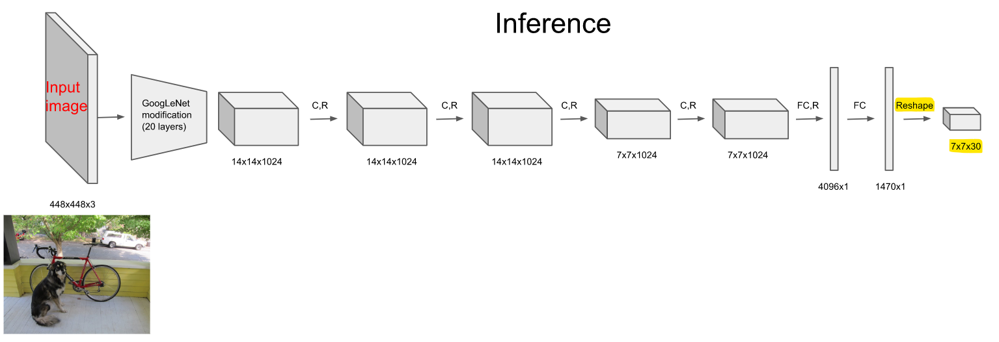

- 위 사진에서 중요하게 본 점은 마지막 Reshape한 7 \* 7 \* 30의 결과이다.

## 2. 사전 지식
### 2.1. bounding box

(추측)  
YOLO에서는 학습 시 모델과 같이 bounding box(anchor)를 같이 학습&저장한다.  
이는 일반적인 찾고자하는 클래스의 크기를 담고 있다.  
찾고자 하는 클래스가 많다면 이는 일반화된 모양이 될 것이다.
즉, 한 셀에 대한 클래스 확률과 같이 그 셀을 중심으로 bounding box를 그려서 confidence(신뢰도)를 매긴다.  
이는 학습 시 특정 갯수만큼 정할 수 있을 걸로 추측된다.  
지나치게 많아지면 속도에 영향을 줄 것으로 보인다.

### 2.2. class

이는 모델에서 찾고자 하는 클래스(물체)의 종류를 나타낸다.  
학습된 모델에는 각자에 대한 판별방법이 있을 것이다.

## 3. 판단
- 마지막 층은 S \* S \* M으로 나타내진다.
    - S : 최종 그리드의 갯수, 아래처럼 사진을 총 S*S로 갈라서 기준을 잡게 한다.
    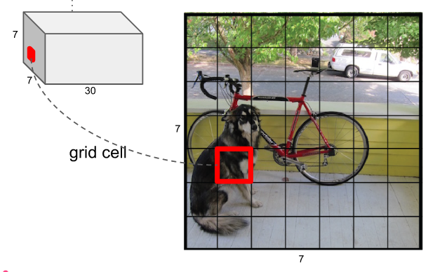
    - M : (number of bounding box * 5 ) + number of class
        - ex) 여기서는 bounding box가 2개, class가 20개  
          => 2 * 5 + 20 = 30개!

### 3.1. 셀 기준에서의 결과

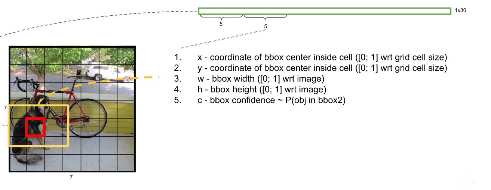

한 셀에서 M개의 array에서 먼저 5 * number of bounding box가 자리를 차지한다.  
각 box 별로 5개의 데이터를 차지한다.  
1번과 2번에는 셀의 좌표가,  
3번과 4번에는 box의 width와 height가 들어간다.  
마지막 5번에는 해당 box에 물체가 있는 정도, 신뢰도를 저장한다.  
아예 없을 경우 신뢰도는 0이 된다.  
이 과정은 box 갯수만큼 진행한다.

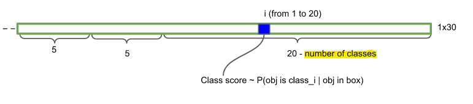

나머지 20개 자리에는 각 클래스에 대한 확률을 저장한다.  
그래서 마지막 갯수를 정하는 수식에서 class의 갯수만큼 더해주는 것이다.

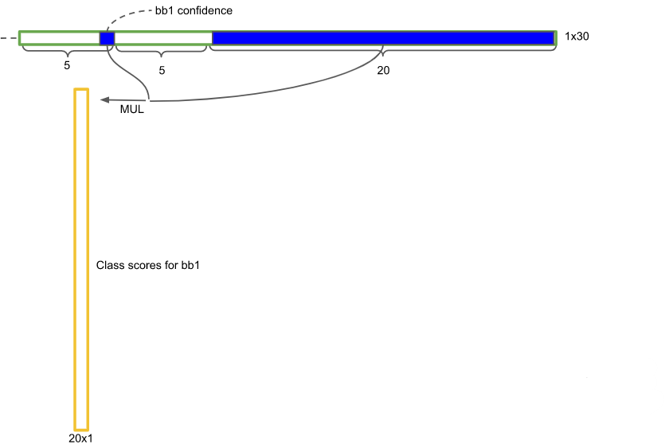

이제 class 확률들에 box에 대한 신뢰도를 행렬곱한다.  
이렇게 되면 한 셀에 물체가 있더라도 학습된 box를 그렸을 때의 겹쳐지는 크기에 따라 수치가 조정된다.  
즉, 중심에서의 셀은 큰 값을 가지게 될 것이다.  
이 과정을 셀 갯수인 S \* S만큼 반복하게 되고, 결과는 한 셀당 box 갯수가 나올 것이다.  
예시에서는 7 \* 7 \* 2 = 98개의 결과가 나온다.

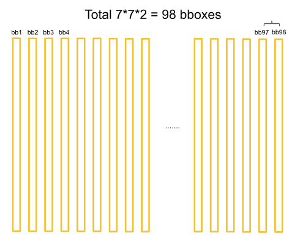

### 3.2. 최종 판단

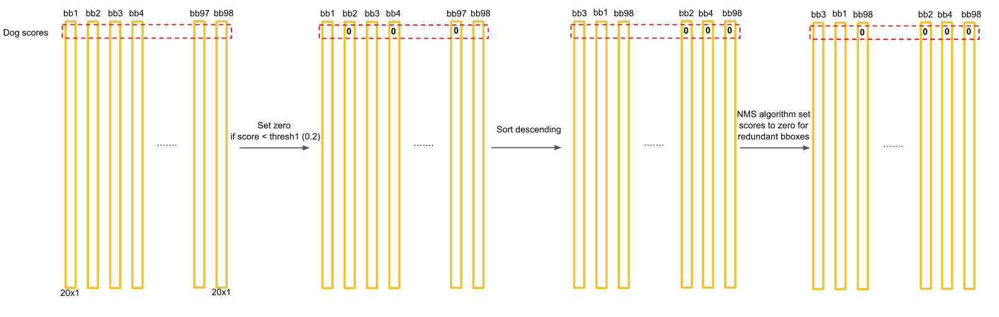

위의 결과로 같은 인덱스에 있는 값들은 한 클래스에 대한 결과값이 된다.  
각 박스별로 그 클래스에 대한 확률의 결과값이 들어 있다.  
1. 먼저 임계점(0.2)보다 적은 것은 0으로 처리해버린다.  
  여기는 없다고 판단한다.
2. 내림차순으로 정렬한다.  
3. NMS(None-Maximum Suppression) 알고리즘을 통해 최종 검출을 한다.

#### 3.2.1 NMS Algorithm
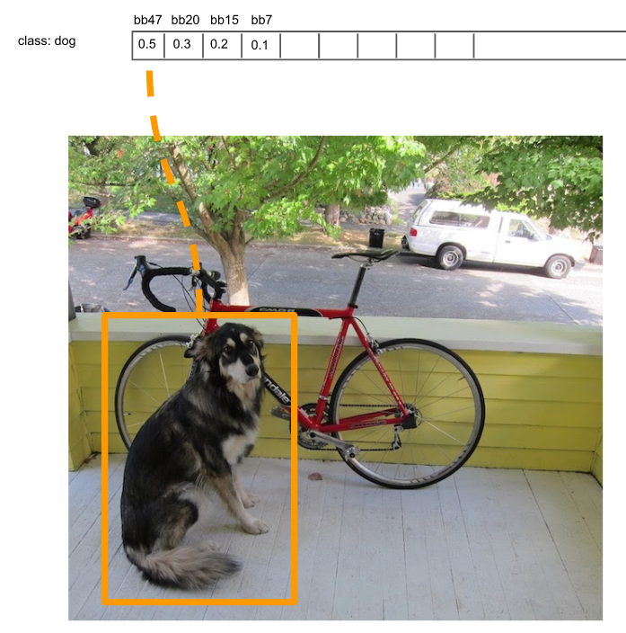

위에서 정렬한 상태가 되면 상단의 array형태가 될 것이다.  
그림처럼 결과별로 box가 이미지에 그려질 것이다.  
가장 score가 높은 box를 bbox_max로 잡고 0이 아닌 box들을 처리해나간다.

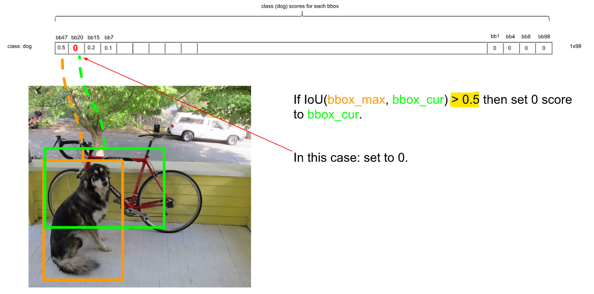

bbox_max 뒤로 이어지는 box들을 비교하면서 겹치는 범위(IoU, Intersection over Union)를 본다.  
겹치는 범위가 0.5보다 크면 이전 값이 크다고 판단하고 그 값을 0으로 처리한다.  
겹치지 않는다면 값을 남기고 continue 처리를 한다.

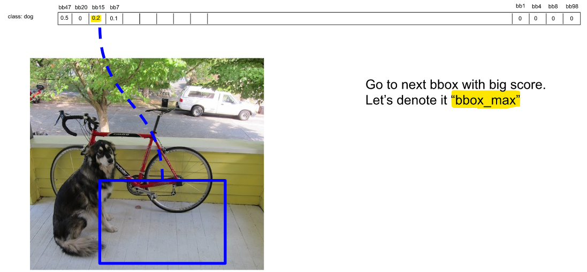

판단이 끝나면 남은 다음으로 큰 값을 bbox_max로 잡고 위의 과정을 반복한다.  
이 과정에서 살아남는 박스들은 해당 클래스의 후보군이 된다.

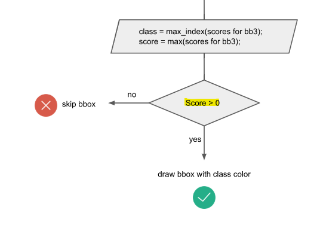

모든 클래스에 이 과정을 반복해주면 box별로 결과수치가 매겨진다.  
이제 이 결과들에서 그릴 box들을 결정해주면된다.  
box에서 max_score와 그의 인덱스를 가져와서 box들을 그려주면 최종 결과가 나오게 된다.

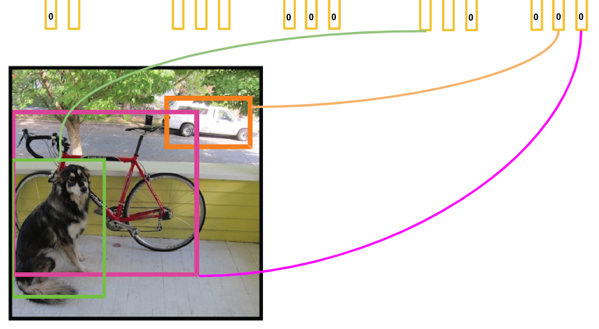

값이 있는 box가 모두 그려진다.  

## 4. 부족한 점
- 위의 결과에서 자전거처럼 큰 이미지나 자동차처럼 작은 이미지는 어떻게 크기를 조정했는가  
  마지막 NMS 알고리즘에서 생략된 부분이 있는 것으로 보인다.

- 느낌은 잡았는데 정확한 수식으로는 이해가 부족하다.
- raw code를 보면서 감을 실체화시켜야 한다.

